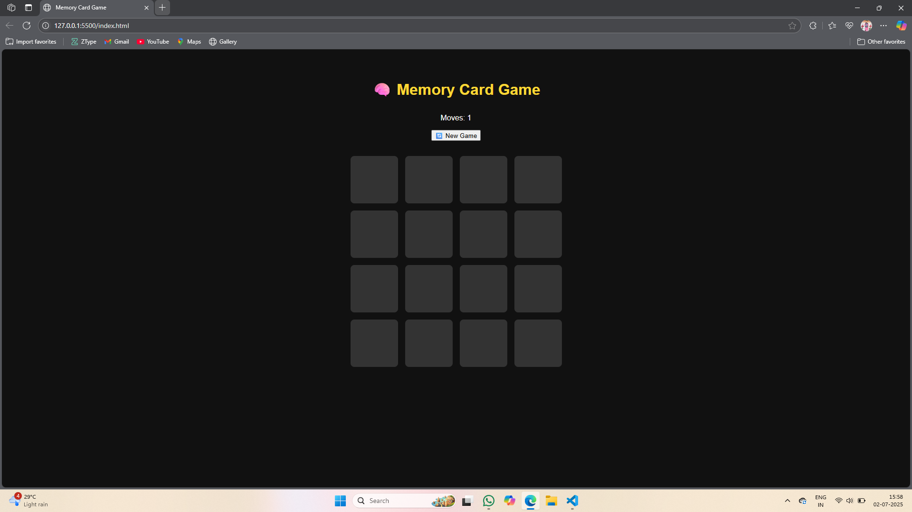

# 🧠 Memory Card Game

A fun and interactive _Memory Match Game_ built using HTML, CSS, and JavaScript.  
Flip the cards, test your memory, and try to match all the pairs with as few moves as possible!

---

## 🎮 Features

- 🃏 Flip-card animation using pure CSS
- 🔁 Card matching logic with dynamic flips
- 🎯 Move counter & win detection
- 🎉 Victory message on completion
- 🔄 New Game (Restart) button
- 📱 Fully responsive for mobile & tablet
- 🌐 SVG-based icons for crisp visuals

---

## 💻 Technologies Used

- HTML5
- CSS3 (Flexbox & Grid)
- JavaScript (Vanilla)
- SVG Icons (for lightweight, scalable images)

---

## 📂 Folder Structure

memory-game/
├── index.html
├── style.css
├── script.js
├── images/  
└── README.md

---

## 📸 Preview

> 
> 

---

## 🚀 How to Play

1. Flip any two cards
2. If they match – they stay revealed
3. If not – they flip back after 1 second
4. Match all pairs to win the game!

---

## 📦 Setup Instructions

1. Clone the repo or download the zip  
2. Open index.html in your browser  
3. Start matching!

---

## 📧 Author

*Divy Chavda*  
[GitHub](https://github.com/divychavda29)

---

> ✅ Built as part of Internship Task 3 – No frameworks or external libraries used.